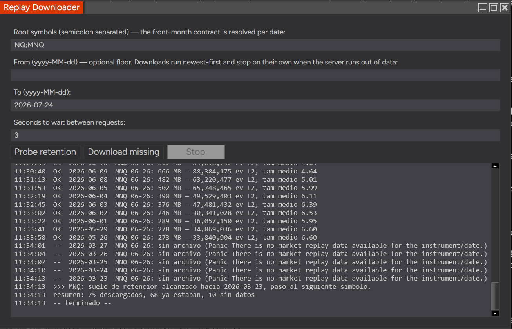

# NT8ReplayDownloader — EdgeLab hardened fork candidate

Derived under MIT from [`jalv92/NT8ReplayDownloader`](https://github.com/jalv92/NT8ReplayDownloader), pinned to upstream commit `d4a9c7aa2048846ab6e6aa45b8f23530c5d60af3`.

**Status:** `SOURCE_HARDENED_NOT_RUNTIME_CERTIFIED`. The source was reviewed and hardened, but still needs compilation and runtime testing inside NinjaTrader 8.1.8.0.

## Install

Copy only `AddOns/ReplayDownloaderEdgeLab.cs` to:

```text
Documents\NinjaTrader 8\bin\Custom\AddOns\
```

Then compile with F5 and open **Control Center → Tools → EdgeLab Replay Downloader**. Do not copy `upstream/ReplayDownloader.cs.txt`; it is retained only as provenance.

## Hardened contract

- Exact contracts only (`NQ 09-26;GC 08-26`); no inferred rolls.
- Every calendar date is requested, including Sundays and holidays.
- Only completed dates before today; maximum 120 days and 20 contracts.
- Delay constrained to 3–60 seconds.
- Undocumented API/header assumptions pinned to NT Core 8.1.8.0.
- Exactly one discoverable HDS client required.
- Structured depth validation: both bid and ask, valid counts and raw header times.
- Invalid pre-existing artifacts quarantined before retry.
- File must remain stable for three seconds before validation.
- Timeout/cancel terminates the entire batch, preventing overlap with an unknown in-flight request.
- Valid artifacts receive SHA-256 custody hashes.
- Every result appends to `db/replay/edgelab_replay_manifest.csv`.
- Continuity remains explicitly uncertified until EdgeLab validates each D→D+1 boundary.

## Mandatory Windows/NT8 test campaign

1. Clean NT 8.1.8.0 compile against baseline.
2. Valid existing file → `SKIP_EXISTING_VALID`.
3. Truncated/no-depth file → quarantine, never skip/pass.
4. Server no-data → `NO_SERVER_DATA`.
5. Known Sunday file → requested and acquired.
6. Disconnect, Stop, and forced timeout → no subsequent request starts.
7. Header counts compared with full `.nrd` decode.
8. D→D+1 clock, bootstrap, BBO and expected-calendar boundary validation in EdgeLab.

`ACQUIRED_VALID_DEPTH` proves only a stable artifact with plausible nonzero L2 header metadata and a hash. It does not prove complete stream decodability, exchange-clock interpretation, MBO/FIFO, or continuity.# NT8 Replay Downloader

A NinjaTrader 8 Add-On that **downloads Market Replay days in bulk**, figures out
by itself how far back NinjaTrader's servers still serve them, and verifies that
each file actually arrived with market depth.



## Why

NinjaTrader's Historical Data window downloads Market Replay data **one day per
click**. Rebuilding a few months of tick-and-depth history means hundreds of
clicks, and three things make it worse:

- **The retention window is undocumented.** You cannot tell where the server
  stops serving data without trying, so you either give up early or waste time
  asking for days that do not exist.
- **Futures roll.** A date range that crosses a quarterly roll needs a different
  contract on each side of it. Ask for the wrong one and you get nothing, or
  worse, a thin back-month file that looks fine until you build on it.
- **A downloaded day can arrive without depth.** Market depth is only present if
  the server has it for that instrument and date. You find out weeks later, when
  your order-flow backtest silently has holes.

This Add-On handles all three.

## Install

1. Download [`AddOns/ReplayDownloader.cs`](AddOns/ReplayDownloader.cs)
2. Copy it to `Documents\NinjaTrader 8\bin\Custom\AddOns\`
3. In NinjaTrader: open the **NinjaScript Editor** and press **F5** to compile
4. Open it from **Control Center → Tools → Replay Downloader**

No dependencies, no DLLs, one file. Requires NinjaTrader 8 **running and
connected to a data feed** — the Add-On borrows the live connection's
historical-data client. Depth requires a feed with Level 2 entitlement.

## Use

Fill in the root symbols (`NQ;MNQ` — **bare roots**, not full contract names) and
press **Download missing**. That is the whole workflow.

It walks **newest day first** and stops each symbol after 5 consecutive
`no market replay data available` answers from the server. So the most valuable
recent days land first, and the run ends by itself exactly at the retention
floor — no configuration, no guessing. `From` is an optional hard floor if you
want to bound the run.

**Probe retention** is for when you just want the date without downloading
everything: it binary-searches for the oldest session still served — about 9
requests to bracket a year — and writes the result into `From`. Successful probes
are real downloads, so nothing is wasted.

Days already on disk **with depth** are skipped. Days on disk **without depth**
are re-requested, which is exactly the case worth fixing.

### Reading the log

```
OK  2026-07-24  NQ 09-26: 184 MB — 26,031,189 L2 events, mean size 2.49
OK  2026-06-10  NQ 06-26: 289 MB — 41,624,726 L2 events, mean size 1.92
--  2026-04-24  NQ 06-26: no file (Panic There is no market replay data available...)
>>> NQ: retention floor reached around 2026-04-20, moving to the next symbol.
```

Every successful line ends with a depth summary read straight from the new file's
header, so a day that arrives **without depth** is visible immediately instead of
weeks later. The contract shown (`NQ 09-26` vs `NQ 06-26`) is resolved per date,
so you can watch the roll happen mid-run.

## How it works

NinjaTrader exposes no documented API for this. The Add-On calls the same method
the Historical Data window uses, located by decompiling `NinjaTrader.Core.dll`:

```csharp
// NinjaTrader.Server.HdsClient — public sealed class
public void RequestMarketReplay(Instrument instrument, DateTime dateEst,
                                Action<ErrorCode,string,object> callback,
                                IProgress progress, object state)
```

The method is public. The `HdsClient` instance hangs off `Connection` through an
**internal** property (`Connection.HistoricalDataClient`), so it is reached by
reflection — Add-Ons run in full trust, so this is allowed.

`NinjaTrader.Core.dll` is obfuscated with AgileDotNet: member *signatures* survive
decompilation, method *bodies* do not. Everything below follows from that:

- **The file appearing on disk is the success signal, not the `ErrorCode`.** A day
  the server does not have can still come back with a clean code.
- **`IProgress` gets a no-op implementation, never `null`.** A null dereference
  inside code that cannot be read is not worth debugging.
- **Requests are issued on `Globals.RandomDispatcher`** while a worker thread
  waits on the callback, mirroring how the Historical Data window issues them.
- **The probe aborts rather than guess** when it hits an error that is *not* "no
  data" — a dropped connection would otherwise move the cut to an invented date.

### Contract roll

`FrontMonth(DateTime)` implements the CME equity-index rule: **roll = 8 days
before expiry**, expiry = third Friday of Mar/Jun/Sep/Dec. Verified against
recorded tick data — NQ 06-26 → 09-26 crossed on **2026-06-11**, which the
function reproduces exactly.

### The `.nrd` header

Depth verification reads the file header directly, no stream parsing:
44 slots × 80 bytes, little-endian. Slots 10 and 11 are L2 Ask and L2 Bid. Each
slot is `{double last, int count, 5× double, int flag, long t0, long t1, long
volumeSum}`. `count` and `volumeSum` are the fields a full stream decode
checksums against, so mean depth size is trustworthy without touching the event
stream — which is just as well, because that stream contains an out-of-spec
volume opcode that breaks hand-written parsers a few KB in.

## Limitations

- NinjaTrader has no headless mode, so this still needs a human to press a button.
- Expired contracts may be gone from NT8's instrument database entirely, in which
  case the day is logged and skipped.
- The holiday list covers Dec 2025 – Sep 2026 and is easy to extend. A missing
  entry costs one skipped request, not a wrong result.
- Retention is set by NinjaTrader, not by this tool. Observed at roughly 90
  calendar days in July 2026, but measure it with the probe rather than trusting
  that number.

## Development

`nt8c check` catches syntax but gives false negatives across files. The real gate
is a staged project build compared against a baseline **without** the file —
NinjaTrader's own stock `DrawingTools/@*.cs` throw thousands of errors when the
`Custom/` tree is compiled from a copied path, so an absolute error count means
nothing on its own.

## License

MIT — see [LICENSE](LICENSE).

Not affiliated with or endorsed by NinjaTrader, LLC. It relies on undocumented
internals that may change in any NinjaTrader release. Verified against
NinjaTrader 8.1.8.0.
